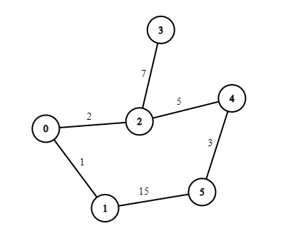

# Corrida diferenciada

Êda gosta muito de corridas e neste final de semana irá participar de uma um pouco diferente, nesta corrida não vence que cruzar a linha de chegada em menor tempo e sim quem cruzar a linha de chegada com mais pontos. O circuito é composto por **N** interseções ligadas por trajetos que possuem uma pontuação única, de modo que a pontuação final de um competidor é dada pela soma das pontuações dos trajetos que ele percorreu. Uma das regras da corrida é que um competidor não pode passar mais de uma vez em uma mesma interseção.

Êda, estrategista como sempre, elaborou uma estratégia para vencer a corrida. Nessa estratégia, sempre que ele se deparar com uma interseção, ele irá optar pelo trajeto que pontue mais, caso exista um caminho que leve à linha de chegada por esse trajeto. Como existem muitas interseções e muitos caminhos que não levam à linha de chegada, Êda pediu a sua ajuda para colocar sua estratégia em prática.

Ajude Êda escrevendo um programa que leia a descrição do circuito da corrida, e determine o caminho pelo qual Êda precisará passar e a pontuação final que ele receberá caso ele siga sua estratégia inicial. 



Nesse exemplo, considerando que o começo da corrida é na interseção 0 e a linha de chegada fica na interseção 5, o caminho percorrido por Êda, seguindo sua estratégia, seria:

- De 0 para 2: Esse caminho dá uma pontuação maior do que ir de 0 para 1.
- De 2 para 4: Apesar de ter uma pontuação menor do que ir para 3, partindo de 3 não é possível chegar à linha de chegada sem repetir a interseção 2.
- De 4 para 5: Único caminho possível.

Finalizando a corrida com 10 pontos.

## Entrada

A entrada é composta por um único caso de teste. A primeira linha de um caso de teste contém 2 inteiros **S** (0 &le; **S** &lt; **N**), a interseção que representa o ponto de partida, e **E** (0 &le; **E** &lt; **N**), a interseção que representa a linha de chegada.

A segunda linha é composta por 2 inteiros **N** (2 &le; **N** &le; **2000**), número de interseções, e **M** (2 &le; **M** &le; **N(N-1)/2**), número de trajetos.

Cada uma das **M** linhas seguintes contém 3 inteiros **V** (0 &le; **V** &lt; **N**), **W** (0 &le; **W** &lt; **N**) e **P** (1 &le; **P** &lt; 2*10^9), informando que existe um trajeto da interseção **V** para a interseção **W** que possui **P** pontos.

## Saída

O seu programa deve imprimir 2 linhas. A primeira linha deve conter um inteiro **T**, onde **T** é igual a pontuação final de Êda ao completar a corrida seguindo sua estratégia. Na linha seguinte imprima o caminho percorrido por Êda separados por ` -> `.

## Exemplo

Esse é o exemplo dado no texto.

### Exemplo de entrada

```
0 5
6 6
0 1 1
0 2 2
2 3 7
2 4 5
1 5 15
5 4 3
```

### *Saída para o exemplo a cima*

```
10
0 -> 2 -> 4 -> 5
```
